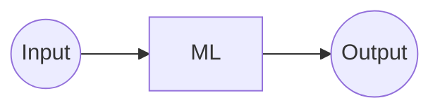
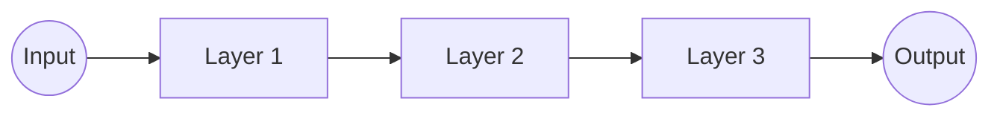

---
---

# Mashine Learing

<blockquote cite="T.M. Mitchell, 1997">
A computer program is said to learn from experience E with respect
to some class of tasks T and performance measure P, if its performance at tasks in
T, as measured by P, improves with experience E.
</blockquote>
<cite>-T.M. Mitchell, 1997</cite>

A program which:
- learn form experiment E <material-symbols-arrow-back :rotate="180" /> data
- in respect to task T <material-symbols-arrow-back :rotate="180" /> goal
- with performance measure P <material-symbols-arrow-back :rotate="180" /> loss function

## Fitting parameters of a function to a set of data

---
---
# Deep Learing

## Mashine Learing

- **Layer:** Function with input and output

<h2>Deep Learing</h2>

<ul>
    <li>Add more Layers!</li>
</ul>

